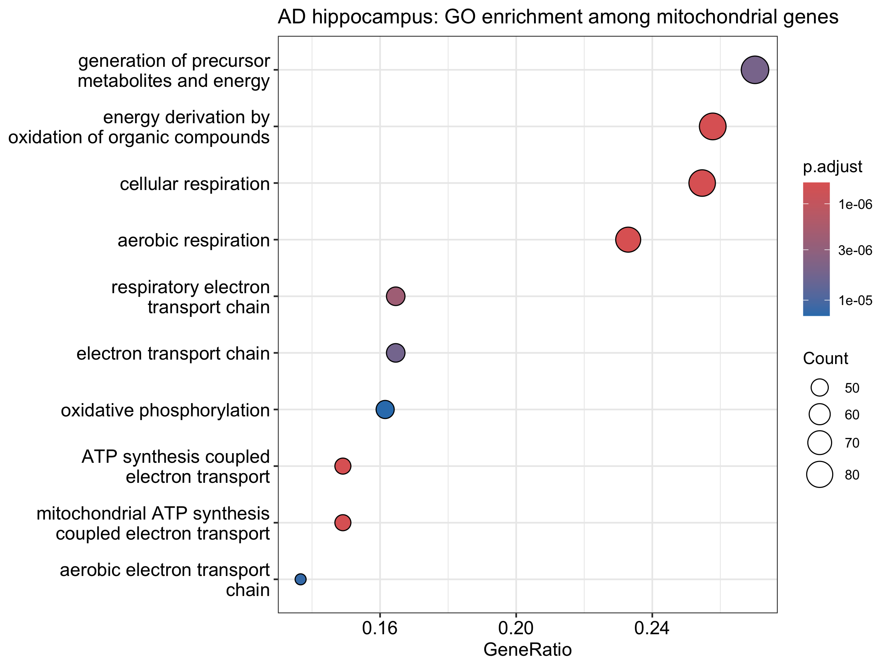
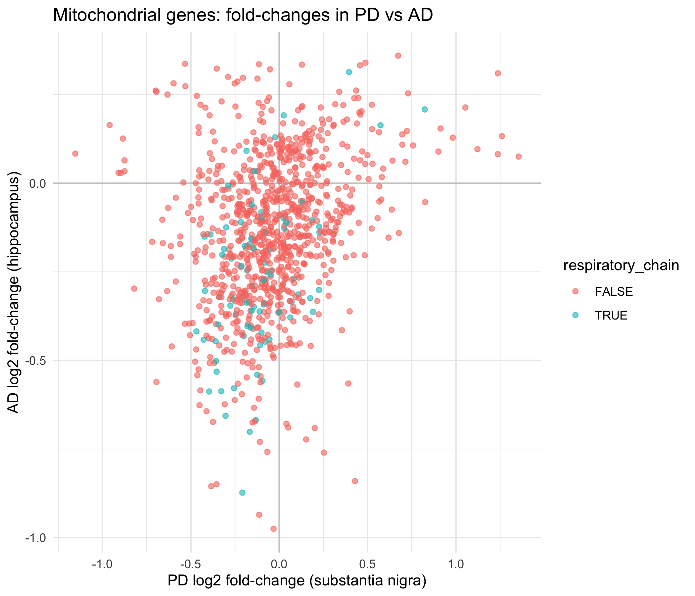
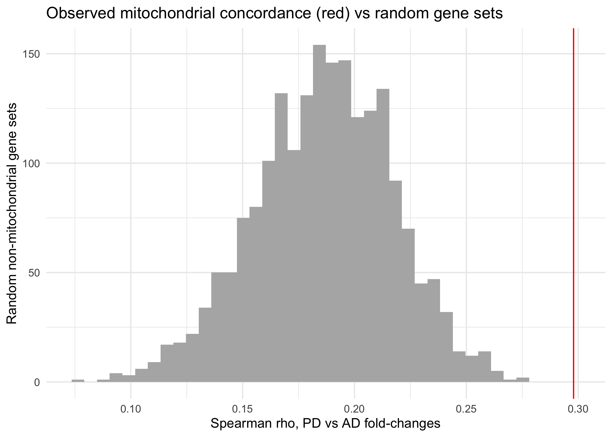

# Mitochondrial gene expression in Parkinson's and Alzheimer's disease brain: an exploratory comparison

An exploratory analysis of public microarray data, done as an undergraduate project. It has not been peer reviewed, and the results are hypothesis-generating, not conclusions.

## Key findings

1. In Alzheimer's disease (AD) hippocampus, respiratory chain and oxidative phosphorylation genes are enriched among the mitochondrial genes that change (adjusted p of roughly 6e-07 to 2e-06 for the top terms).
2. In Parkinson's disease (PD) substantia nigra, no mitochondrial gene survives genome-wide FDR correction and no GO term is enriched. The dataset is small and probably underpowered.
3. The two diseases do not share more significantly changed mitochondrial genes than expected by chance (66 observed vs 74.4 expected).
4. Even so, mitochondrial fold-changes are positively correlated between PD and AD (Spearman rho = 0.30). Random sets of non-mitochondrial genes give about 0.19 on average, and none of 2,000 random sets reached 0.30. A shared postmortem-brain effect may contribute to part of this signal.
5. Respiratory chain genes are downregulated more often than other mitochondrial genes in both PD and AD, with stronger enrichment for downregulation in AD.

## Question

Do PD and AD brain tissue show similar changes in mitochondrial gene expression, and are the changes concentrated in particular mitochondrial processes?

## Data

| Disease | GEO accession | Tissue | Samples |
|---|---|---|---|
| PD | GSE7621 | Substantia nigra | 9 control, 16 PD |
| AD | GSE36980 | Hippocampus (subset of a three-region dataset) | 10 control, 8 AD |

Mitochondrial genes come from MitoCarta3.0 (1,136 human genes). The original publication for each dataset is listed on its GEO page.

## Methods

1. PD expression values were on a linear intensity scale, so they were log2-transformed (values floored at 1). AD values were already on a log scale.
2. Differential expression (disease vs control) with limma, run separately for each dataset.
3. Probes were mapped to gene symbols and restricted to MitoCarta3.0 genes. Probes annotated with several symbols were not split and drop out of the mitochondrial set. Gene-level fold-changes average the probes for the same gene.
4. GO biological process enrichment (clusterProfiler, Benjamini-Hochberg) on mitochondrial genes with nominal p < 0.05, using all mitochondrial genes tested in that dataset as the background.
5. Cross-disease comparison: a hypergeometric overlap test, Spearman correlation of fold-changes, and a permutation control against random sets of non-mitochondrial genes (2,000 draws, seed 1).
6. Respiratory chain test: the gene set is every human gene annotated to GO:0022904 (respiratory electron transport chain) in the GO annotation database. It is defined independently of both datasets. Fisher's exact test compares how often these genes go down against other mitochondrial genes, and a Wilcoxon test compares their fold-changes.

## Results

### Differential expression

- 996 mitochondrial genes were tested in PD, 1,019 in AD, and 986 in both.
- PD: the best mitochondrial gene has a genome-wide adjusted p of 0.13, so none passes FDR 0.05.
- AD: the hits are modest. The best mitochondrial gene has a genome-wide adjusted p of 0.046.

### Enrichment

- AD: respiratory chain and oxidative phosphorylation terms are enriched among changed mitochondrial genes (fold enrichment about 1.6 to 2.0, adjusted p roughly 6e-07 to 2e-06). Several of these terms contain largely the same genes, so they represent one signal, not several.
- PD: no GO term is enriched.



Figure 1. GO terms enriched among nominally significant mitochondrial genes in AD hippocampus. Dot size is the gene count and colour is the adjusted p-value.

### Cross-disease comparison

- 223 mitochondrial genes are nominally significant in PD and 329 in AD. 66 are significant in both, against 74.4 expected by chance (hypergeometric p = 0.93). There is no excess of shared individual genes.
- Across all 986 genes tested in both datasets, PD and AD fold-changes are positively correlated (Spearman rho = 0.30).
- Random sets of non-mitochondrial genes of the same size give rho of 0.19 on average (maximum 0.27). None of 2,000 draws reached 0.30 (permutation p = 0.0005).



Figure 2. Each point is a mitochondrial gene. Axes show the log2 fold-change in PD and in AD. Respiratory chain genes are coloured separately.



Figure 3. The histogram is the PD-AD correlation for 2,000 random non-mitochondrial gene sets. The red line is the observed mitochondrial correlation.

### Respiratory chain direction

82 respiratory chain genes were tested in both datasets.

| | Respiratory chain genes (down / up) | Other mitochondrial genes (down / up) | Fisher's exact p | Wilcoxon p |
|---|---|---|---|---|
| PD | 63 / 19 | 511 / 393 | 0.000272 | 0.00102 |
| AD | 75 / 7 | 650 / 254 | 3.88e-05 | 3.74e-09 |

Numbers come from `results/summary_stats.txt`. Because the gene set is defined from GO annotation and not from either dataset, the test is not circular in either disease.

## Interpretation

Reduced expression of mitochondrial respiratory chain genes in neurodegeneration has been reported before, so these results agree with existing biology and are not presented as a new discovery.

The analysis supports a modest claim: mitochondrial gene expression changes are somewhat concordant between PD and AD brain, over and above a general effect shared by all genes, without any excess of shared individually significant genes.

The lack of excess overlap suggests that the two diseases do not necessarily alter the same individual mitochondrial genes. Instead, the positive fold-change correlation suggests that some broader mitochondrial transcriptional patterns may be shared.

The respiratory-chain analysis provides additional evidence that mitochondrial genes involved in respiratory electron transport tend to show stronger downregulation than other mitochondrial genes in both datasets.

## Limitations

- Small samples, with different array platforms and different brain regions in the two datasets.
- Postmortem tissue: neuron loss and changes in cell composition can shift mitochondrial gene expression in both diseases without disease-specific mitochondrial pathology. The non-mitochondrial correlation (about 0.19) suggests this may contribute to the observed signal.
- Gene lists use a nominal p < 0.05 cutoff because almost nothing passes genome-wide FDR. This is exploratory.
- Mitochondrial genes are co-regulated, so the tests treat correlated genes as independent and may therefore be optimistic.
- Probes with several gene symbols were not split.
- The random-gene permutation control does not match genes on all possible properties, such as expression level or variance.
- The results are correlational and make no causal claim.
- The findings have not yet been replicated in independent PD and AD datasets.

## Possible next steps

- Replicate the concordance in independent PD and AD expression datasets.
- Use a permutation null matched to mitochondrial genes on expression level.
- Protein-protein interaction network analysis and hub genes.
- Cell-type deconvolution to separate cell composition effects from per-cell expression changes.
- Compare mitochondrial pathway-level changes across additional brain regions.

## Reproducing the analysis

1. Download `Human.MitoCarta3.0.xls` from the Broad Institute MitoCarta3.0 page and save it in your Downloads folder (or in this folder, but do not commit it).
2. Open `mitochondrial_PD_AD_analysis.R` in RStudio and choose **Session → Set Working Directory → To Source File Location**.
3. Run the script. It downloads both GEO datasets and writes the `results/` and `figures/` folders.

Developed with R 4.6.1. After a run, `results/session_info.txt` lists the exact package versions.

## Repository structure

```text
PD-AD-mitochondrial-analysis/
│
├── mitochondrial_PD_AD_analysis.R
├── README.md
├── .gitignore
│
├── figures/
│   ├── AD_GO_enrichment_dotplot.png
│   ├── PD_AD_fold_change_scatter.png
│   └── permutation_null_vs_observed.png
│
└── results/
    ├── AD_GO_enrichment.csv
    ├── AD_mitochondrial_DE_results.csv
    ├── PD_AD_gene_level_fold_changes.csv
    ├── PD_mitochondrial_DE_results.csv
    ├── session_info.txt
    └── summary_stats.txt
    ...
## References

- Rath S, et al. MitoCarta3.0: an updated mitochondrial proteome now with sub-organelle localization and pathway annotations. *Nucleic Acids Research*, 2021.
- Ritchie ME, et al. limma powers differential expression analyses for RNA-sequencing and microarray studies. *Nucleic Acids Research*, 2015.
- Wu T, et al. clusterProfiler 4.0: a universal enrichment tool for interpreting omics data. *The Innovation*, 2021.
- Davis S, Meltzer PS. GEOquery: a bridge between the Gene Expression Omnibus (GEO) and BioConductor. *Bioinformatics*, 2007.

## Disclaimer

This is an educational and exploratory undergraduate research project. It has not been peer reviewed, and the findings should not be interpreted as clinical, diagnostic, or causal evidence.